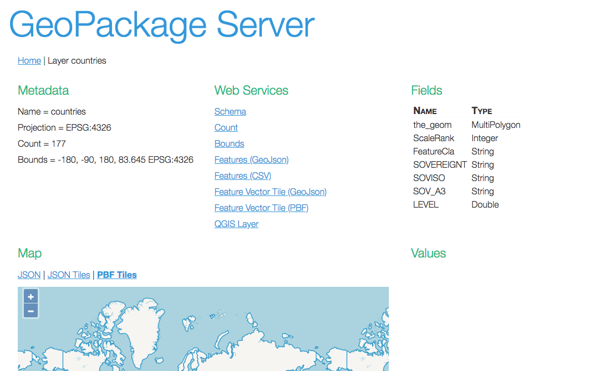
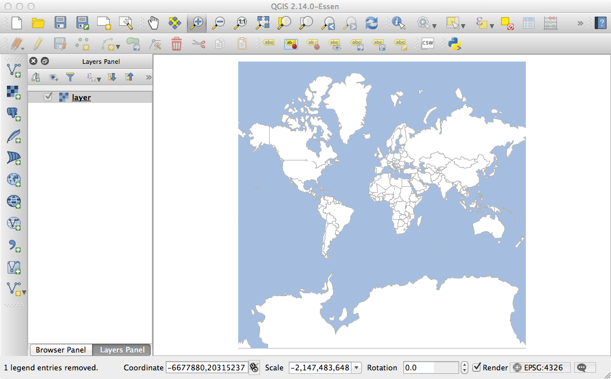

[](https://travis-ci.org/jericks/GeoPackageServer)

GeoPackage Server
--------------
Serve your GeoPackage database on the web.

Build
-----

```bash
./gradlew build
```

Run tests
--------------------
```bash
./gradlew test
```

Run end to end tests
--------------------
```bash
./gradlew -Dwebdriver.chrome.driver=/Your/Path/To/chromedriver e2e
```

Run
---

java -jar geopackageserver-0.3.0.jar --file=data.gpkg --readOnly=true
```

or if you are building the project:

```bash
java -jar build/libs/geopackageserver-0.3.0.jar --file=data.gpkg --readOnly=true
```

and browse to http://localhost:8080:

Home Page


Tile Page


Layer Page



Tile Examples
-------------

**Get a List of Tile Layers**

```bash
curl http://localhost:8080/tiles
```

**Inspect Tile Layer Metadata**

```bash
curl http://localhost:8080/tiles/world/pyramid
```

```bash
http://localhost:8080/tiles/world/tile/counts
```

**Create QGIS/GDAL Layer File for Tile Layer**

```bash
curl -o layer.xml http://localhost:8080/tiles/world/gdal && qgis layer.xml
```



**Download Tiles**

```bash
curl -o tile_0_0_0.png http://localhost:8080/tiles/world/tile/0/0/0
```

```bash
curl -o tile_1_0_0.png http://localhost:8080/tiles/world/tile/1/0/0
```

**Download Raster**
```bash
curl -o us.png http://localhost:8080/tiles/world/raster/400/400/-156.533203,3.688855,-50.712891,56.800878
```

**Create a new Tile Layer**

```bash
curl -H "Content-Type: application/json" -X POST -d 'Mercator' http://localhost:8080/tiles/world_light
```

**Delete a Tile Layer**

```bash
curl -X DELETE http://localhost:8080/tiles/world_light
```

**Add/Update a Tile**

```bash
curl -F "file=@tile.png" http://localhost:8080/tiles/world/tile/5/0/0
```

```bash
curl -o tile_5_0_0.png http://localhost:8080/tiles/world/tile/5/0/0
```

**Delete a Tile**

```bash
curl -X DELETE http://localhost:8080/tiles/world/tile/5/0/0
```

Layer Examples
--------------

**Get a List of Layers**

```bash
curl http://localhost:8080/layers
```

**Inspect Layer Metadata**

```bash
curl http://localhost:8080/layers/countries/schema
```

```bash
curl http://localhost:8080/layers/countries/count
```

```bash
curl http://localhost:8080/layers/countries/bounds
```

**View Features**

```bash
curl http://localhost:8080/layers/countries/features.json
```

```bash
curl -o countries.csv http://localhost:8080/layers/countries/features.csv
```

**Create a new Layer**

```bash
curl -H "Content-Type: application/json" -X POST -d '{"name":"random","projection": "EPSG:4326","geometry": "geom","fields":[{"name":"geom","type":"Point","projection":"EPSG:4326"},{"name":"pid","type":"int"}]}' http://localhost:8080/layers/random
```

**Delete a Layer**

```bash
curl -X DELETE http://localhost:8080/layers/random
```

**Update a Layer**

```bash
curl -X PUT -d field=pid -d value=1 -d cql=ALL http://localhost:8080/layers/random
```

**Add a Feature**

```bash
curl -H "Content-Type: application/json" -X POST -d '{"type":"Feature","geometry":{"type":"Point","coordinates":[1,2]},"properties":{"pid":1}}' http://localhost:8080/layers/random/feature
curl -H "Content-Type: application/json" -X POST -d '{"type":"Feature","geometry":{"type":"Point","coordinates":[2,3]},"properties":{"pid":2}}' http://localhost:8080/layers/random/feature
curl -H "Content-Type: application/json" -X POST -d '{"type":"Feature","geometry":{"type":"Point","coordinates":[3,4]},"properties":{"pid":3}}' http://localhost:8080/layers/random/feature
curl -H "Content-Type: application/json" -X POST -d '{"type":"Feature","geometry":{"type":"Point","coordinates":[5,6]},"properties":{"pid":4}}' http://localhost:8080/layers/random/feature
curl -H "Content-Type: application/json" -X POST -d '{"type":"Feature","geometry":{"type":"Point","coordinates":[7,8]},"properties":{"pid":5}}' http://localhost:8080/layers/random/feature
```

**Delete a Feature**

```bash
curl -X DELETE http://localhost:8080/layers/random/feature/random.1
```

**Delete Features**

```bash
curl -X DELETE http://localhost:8080/layers/random/feature?cql=pid%3E2
```

**Create QGIS/GDAL Layer File for Vector Layer**

```bash
curl -o layer.xml http://localhost:8080/layers/countries/gdal && qgis layer.xml
```


